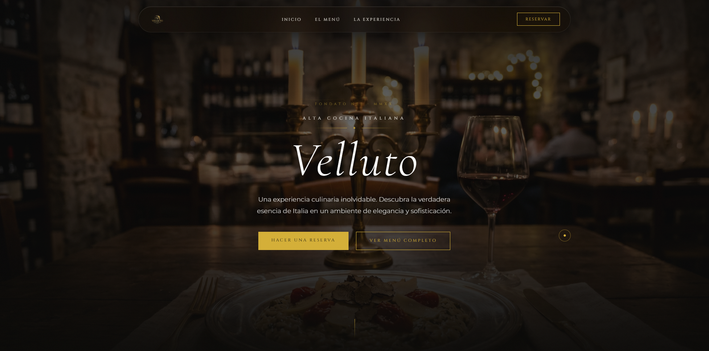
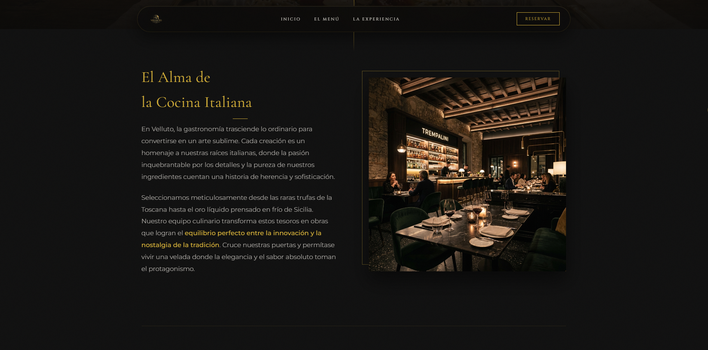
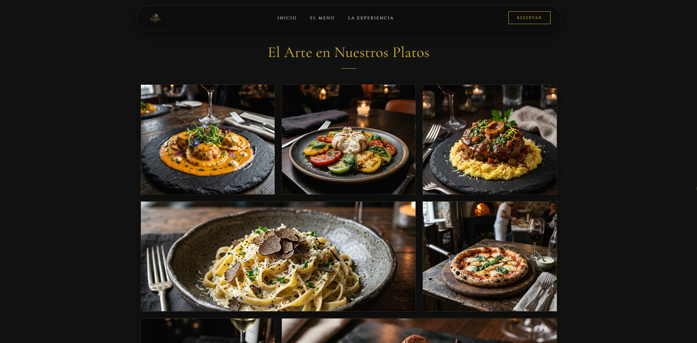
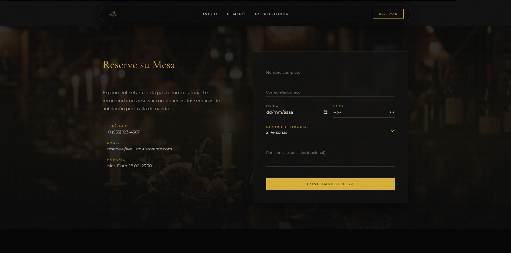
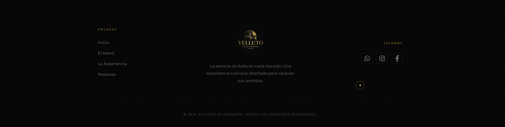
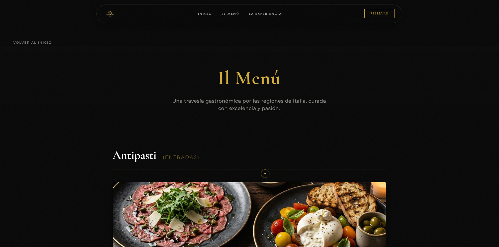
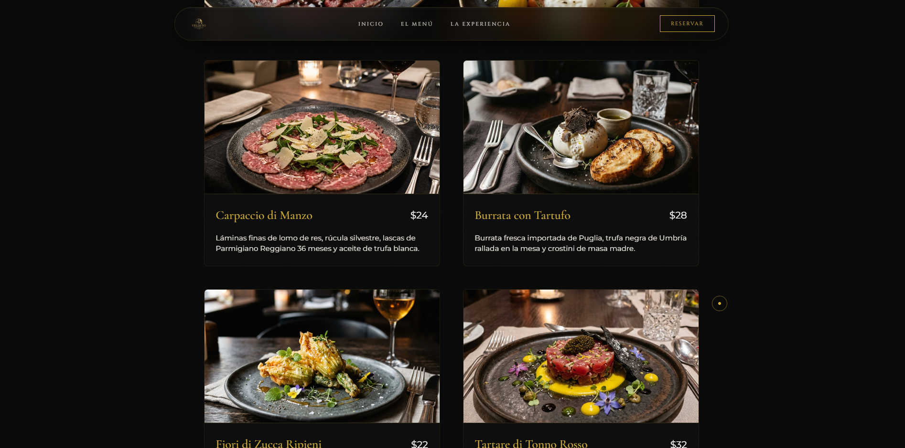
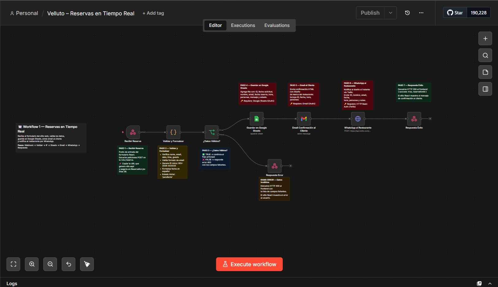

# Velluto Ristorante - Proyecto de Reservas Web y Automatizaciones con n8n

Este proyecto consiste en una aplicación web moderna (Landing Page y Sistema de Reservas) para el restaurante **Velluto Ristorante**, complementada con un robusto sistema de backend automatizado mediante **n8n** para la gestión de reservas y notificaciones.

## 🛠️ Tecnologías y Herramientas Utilizadas
- **Frontend:** React + Vite
- **Estilos y UX:** CSS Puro (con variables de diseño, animaciones fluidas, cursor personalizado y barra de progreso de scroll)
- **Backend / Automatización:** n8n (Node-based workflow automation tool)
- **Integraciones:** Google Sheets, Gmail, Twilio (WhatsApp API)

---

## 💻 Desarrollo Frontend (React)

A continuación, una vista previa de cómo quedó la página (desliza para ver más):

La web fue construida utilizando React y Vite, diseñada para ofrecer una experiencia premium y fluida al usuario. Se desarrollaron los siguientes componentes principales:

1. **Interfaz de Usuario:**
   - `Navbar` y `Hero`: Bienvenida atractiva con diseño moderno.
   - `Experience` y `DiningIllustration`: Secciones que detallan el ambiente y la propuesta de valor del restaurante, apoyadas con animaciones SVG.
   - `Menu` y `FullMenu`: Presentación interactiva de los platos disponibles.
   - `Footer`: Información de contacto y enlaces.

2. **Mejoras de Experiencia de Usuario (UX):**
   - `Cursor.jsx`: Un cursor interactivo personalizado que sigue el movimiento del mouse.
   - `ScrollProgress.jsx`: Una barra de progreso que indica visualmente cuánto se ha desplazado en la página.

3. **Sistema de Reservas (`Reservation.jsx`):**
   - Formulario de reservas que captura Nombre, Email, Fecha, Hora, Número de Personas y Mensaje opcional.
   - Se comunica directamente con el Webhook de n8n para procesar la reserva sin necesidad de un backend tradicional propio.

---

## ⚙️ Automatizaciones con n8n

A continuación se muestra el workflow de reservas implementado:

El núcleo operativo del restaurante fue automatizado creando dos flujos de trabajo (workflows) en **n8n** para procesar las reservas en tiempo real y mantener al equipo informado.

### 1. Workflow de Reservas en Tiempo Real (`n8n-velluto-reservas.json`)
Este flujo se activa instantáneamente cada vez que un cliente envía el formulario desde la web.

- **Recepción (Webhook):** Escucha las peticiones POST enviadas por el componente `Reservation.jsx`.
- **Validación y Formateo:** Un nodo de código valida que los campos estén completos, verifica el formato del email, formatea la fecha al español y genera un ID único de reserva (ej. `RSV-2026-123456`).
- **Control de Flujo (IF):** Si los datos son inválidos, devuelve un error 400 al frontend. Si son válidos, continúa.
- **Almacenamiento:** Inserta automáticamente los datos en una fila de **Google Sheets**, centralizando la base de datos del restaurante.
- **Notificación al Cliente:** Utiliza la API de **Gmail** para enviar un correo HTML con diseño de marca confirmando los detalles de la reserva al cliente.
- **Notificación al Restaurante:** Utiliza la API de **Twilio** para enviar un mensaje instantáneo por **WhatsApp** al dueño/staff con los datos de la nueva reserva.
- **Respuesta al Frontend:** Devuelve un HTTP 200 OK al sitio web para que el usuario vea el mensaje de confirmación en pantalla.

### 2. Workflow de Resumen Diario (`n8n-velluto-resumen-diario.json`)
Este flujo está diseñado para el equipo administrativo y el staff del restaurante, ejecutándose de forma automática todos los días de operación.

- **Disparador Programado (Cron):** Se ejecuta a las **8:00 AM** de martes a domingo.
- **Extracción de Datos:** Lee todas las reservas almacenadas en la base de datos de Google Sheets.
- **Procesamiento de Datos:** Un script en JavaScript filtra exclusivamente las reservas correspondientes al día de hoy (excluyendo cancelaciones) y las ordena por hora.
- **Control Antispam (IF):** Verifica si hay reservas para el día. Si no hay, el flujo se detiene para no molestar al equipo.
- **Reporte por WhatsApp:** Si hay reservas, utiliza **Twilio** para enviar un resumen matutino por WhatsApp al dueño/staff que incluye:
  - Fecha del día.
  - Total de reservas y número de comensales.
  - Cantidad de reservas pendientes de confirmación.
  - Una lista detallada por hora, indicando el nombre del cliente y el número de personas.

---

## 🚀 Cómo poner en marcha el proyecto

1. **Frontend:**
   - Entrar a la carpeta `laura-restaurant` (o ejecutar en la raíz correspondiente).
   - Instalar dependencias con `npm install`.
   - Iniciar el servidor de desarrollo con `npm run dev`.

2. **Automatizaciones n8n:**
   - Importar los archivos JSON (`n8n-velluto-reservas.json` y `n8n-velluto-resumen-diario.json`) en una instancia de n8n.
   - Configurar las credenciales necesarias (Google Sheets OAuth2, Gmail OAuth2 y Twilio HTTP Basic Auth).
   - Configurar las variables de entorno requeridas en n8n (`TWILIO_ACCOUNT_SID` y `RESTAURANT_OWNER_PHONE`).
   - Reemplazar el ID de Google Sheets (`TU_GOOGLE_SHEET_ID_AQUI`).
   - Copiar la URL generada por el nodo Webhook del Workflow 1 y pegarla en el componente `Reservation.jsx` (línea 36).
   - Activar ambos Workflows.
